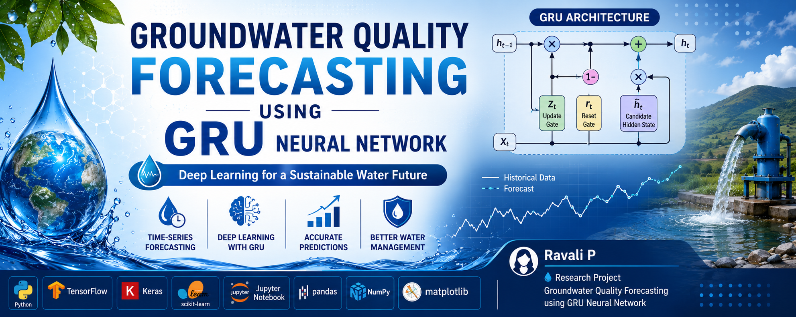
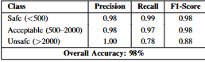
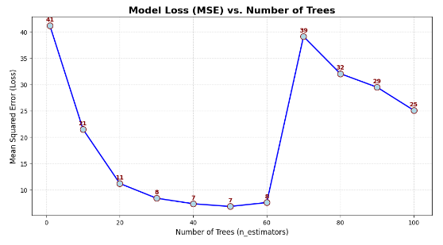

<h1 align="center">🌊 Groundwater Quality Forecasting using GRU Neural Network</h1>

<p align="center">
Deep Learning based Time-Series Forecasting of Groundwater Quality
</p>

<p align="center">

</p>

<p align="center">


</p>

---

# 📑 Table of Contents

- 📌 Project Overview
- 🎯 Objectives
- 📊 Dataset
- 🛠 Technologies Used
- 📂 Project Structure
- 🧠 Model Workflow
- 📈 Model Performance
- 🚀 Installation & Usage
- 📈 Results
- 🔮 Future Scope
- 👩‍💻 Author
- 📜 License

---

# 📌 Project Overview

Groundwater is one of the most valuable natural resources for drinking, agriculture, and industrial use. Monitoring and forecasting groundwater quality enables better planning and sustainable water resource management.

This project implements a **Gated Recurrent Unit (GRU)** based Deep Learning model to forecast groundwater quality using historical groundwater quality data. The project also compares GRU with baseline machine learning models to evaluate predictive performance.

---

# 🎯 Objectives

- Forecast groundwater quality using historical data.
- Develop a GRU-based Deep Learning model.
- Compare GRU with baseline machine learning algorithms.
- Visualize training performance using accuracy and loss graphs.

---

# 📊 Dataset

The project uses a groundwater quality dataset containing important water quality parameters such as:

- pH
- Electrical Conductivity (EC)
- Total Dissolved Solids (TDS)
- Chloride
- Sulphate
- Nitrate
- Hardness
- Other groundwater quality indicators

---

# 🛠 Technologies Used

| Category | Tools |
|----------|-------|
| Programming | Python |
| Deep Learning | TensorFlow, Keras |
| Data Analysis | Pandas, NumPy |
| Visualization | Matplotlib |
| Machine Learning | Scikit-learn |
| Development | Jupyter Notebook |

---

# 📂 Project Structure

```text
Groundwater-quality-GRU-prediction
│
├── data
│   └── water_quality_dataset.csv
│
├── images
│   ├── banner.png
│   ├── Accuracy.png
│   └── Loss.png
│
├── notebooks
│   ├── GRU_Model.ipynb
│   └── Baseline_Models.ipynb
│
├── requirements.txt
├── README.md
├── LICENSE
└── .gitignore
```

---

# 🧠 Model Workflow

```text
Groundwater Dataset
        │
        ▼
Data Cleaning
        │
        ▼
Feature Scaling
        │
        ▼
Train-Test Split
        │
        ▼
GRU Neural Network
        │
        ▼
Model Training
        │
        ▼
Prediction
        │
        ▼
Performance Evaluation
```

---

# ⭐ Repository Highlights

- ✅ Deep Learning using GRU
- ✅ Time-Series Forecasting
- ✅ Groundwater Quality Prediction
- ✅ Baseline Model Comparison
- ✅ Data Visualization
- ✅ Research-Oriented Implementation

---

# 📊 Model Performance

## Training Accuracy

<p align="center">

</p>

---

## Training Loss

<p align="center">

</p>

---

# 🚀 Installation & Usage

## Clone the Repository

```bash
git clone https://github.com/ravali5555/Groundwater-quality-GRU-prediction.git
```

## Install Required Libraries

```bash
pip install -r requirements.txt
```

## Run the Project

1. Open `notebooks/GRU_Model.ipynb`
2. Run all notebook cells.
3. View the prediction results and evaluation metrics.

---

# 📈 Results

The GRU model successfully learns temporal groundwater quality patterns and provides accurate forecasting performance.

The project also includes baseline machine learning models to compare prediction accuracy and demonstrate the effectiveness of GRU for time-series forecasting.

---

# 🔮 Future Scope

- Hyperparameter Optimization
- LSTM & Bi-LSTM Comparison
- Explainable AI (XAI)
- Real-Time Groundwater Monitoring
- Web Dashboard Deployment
- Cloud Deployment

---

# 👩‍💻 Author

### **Ravali P**

**Research Project**

Groundwater Quality Forecasting using GRU Neural Network

GitHub: https://github.com/ravali5555

---

# 🙏 Acknowledgements

This project was developed as part of research on groundwater quality forecasting using deep learning techniques.

---

# ⭐ Support

If you found this project useful, please consider giving it a ⭐ on GitHub.

---

# 📜 License

This project is licensed under the **MIT License**.
